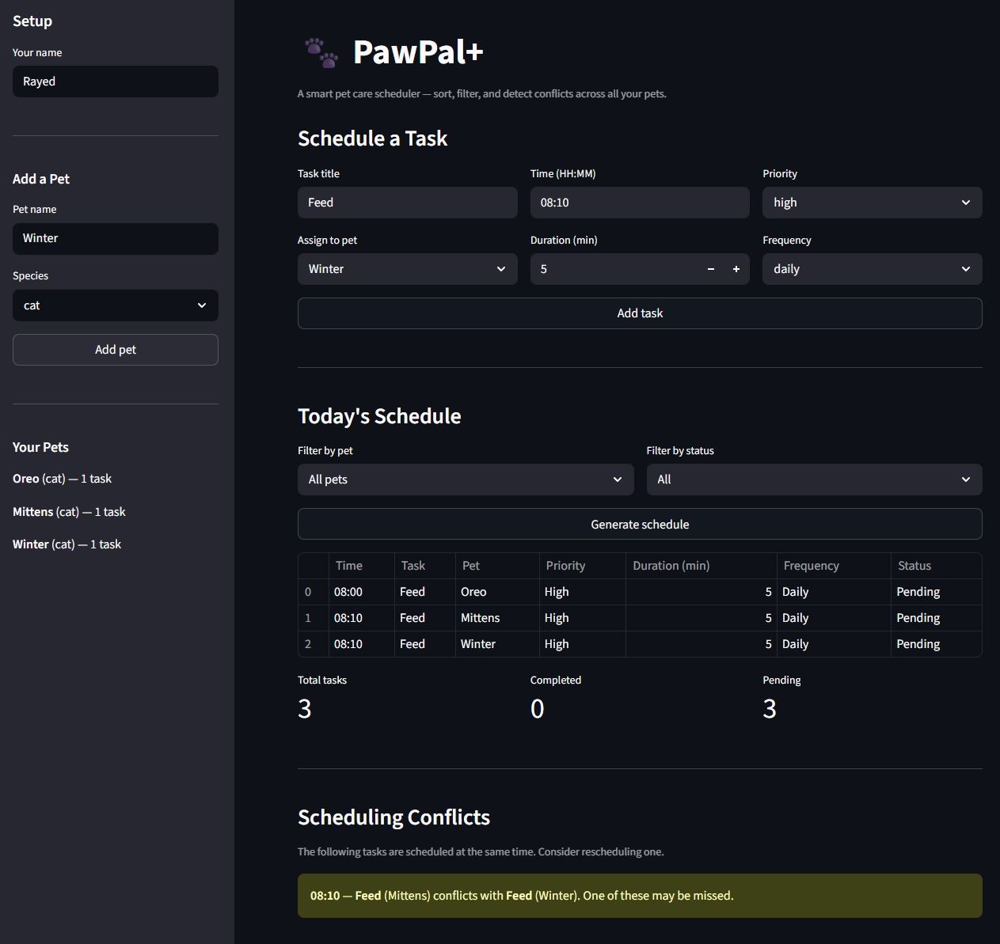

# PawPal+ 🐾

A smart pet care scheduling app built with Python and Streamlit. PawPal+ helps pet owners stay consistent with daily care routines by organizing tasks, detecting conflicts, and automatically handling recurring activities.

---

## Features

- **Multi-pet management** — register multiple pets under one owner profile; each pet maintains its own independent task list
- **Sorting by time** — tasks are sorted chronologically by HH:MM start time using Python's `sorted()` with a lambda key; when two tasks share the same time, priority (high → medium → low) acts as a tiebreaker
- **Filter by pet or status** — view tasks for a specific pet, or narrow by pending/completed status; filters can be combined
- **Conflict warnings** — the Scheduler scans all tasks pairwise and surfaces a plain-English warning when two tasks are booked at the same time, so no care activity gets missed
- **Daily and weekly recurrence** — marking a recurring task complete automatically creates the next occurrence using Python's `timedelta` (daily: +1 day, weekly: +7 days), keeping the schedule self-maintaining
- **Live Streamlit UI** — sidebar-based setup, filterable schedule table, summary metrics (total / completed / pending), and color-coded conflict alerts

---

## System Architecture

Four core classes work together:

| Class | Responsibility |
|-------|---------------|
| `Task` | Holds all activity data; produces next occurrence on completion |
| `Pet` | Stores a pet's identity and task list |
| `Owner` | Manages multiple pets; aggregates all tasks |
| `Scheduler` | Sorts, filters, detects conflicts, and handles task completion |

UML diagram: see `Mernaid.md` in the project root.

---

## Getting Started

### Setup

```bash
python -m venv .venv
source .venv/bin/activate  # Windows: .venv\Scripts\activate
pip install -r requirements.txt
```

### Run the app

```bash
streamlit run app.py
```

### Run the CLI demo

```bash
python main.py
```

---

## Smarter Scheduling

PawPal+ uses algorithmic logic to go beyond a simple task list:

- **Sort by time** — tasks are sorted chronologically by HH:MM start time, with priority (high → medium → low) as a tiebreaker when two tasks share the same time slot
- **Filter by pet or status** — view only a specific pet's tasks, or show only pending/completed tasks across all pets
- **Conflict detection** — the scheduler scans all tasks pairwise and warns when two tasks are scheduled at the exact same time
- **Recurring tasks** — marking a daily or weekly task complete automatically creates the next occurrence with an updated due date using Python's `timedelta`

---

## Testing PawPal+

Run the full test suite with:

```bash
python -m pytest
```

The suite contains 14 automated tests covering:

- **Task completion** — `mark_complete()` sets status correctly for one-time, daily, and weekly tasks
- **Recurrence logic** — daily tasks produce a next occurrence due tomorrow; weekly tasks due in 7 days
- **Sorting correctness** — tasks added out of order are returned in chronological HH:MM order, with priority as a tiebreaker
- **Conflict detection** — same-time tasks are flagged; clean schedules return an empty list
- **Filtering** — tasks can be filtered by pet name, completion status, or both; unknown pet names return `[]` gracefully
- **Edge cases** — scheduler with no tasks, filtering for a non-existent pet, marking an already-complete task

**Confidence level: ⭐⭐⭐⭐ (4/5)**
The core scheduling behaviors are fully verified. The one gap is duration-based overlap detection — two tasks that overlap in time but don't share an exact start time won't be flagged. That's a known tradeoff documented in `reflection.md`.

---

## 📸 Demo



---

## Suggested Workflow

1. Read the scenario carefully and identify requirements and edge cases.
2. Draft a UML diagram (classes, attributes, methods, relationships).
3. Convert UML into Python class stubs (no logic yet).
4. Implement scheduling logic in small increments.
5. Add tests to verify key behaviors.
6. Connect your logic to the Streamlit UI in `app.py`.
7. Refine UML so it matches what you actually built.
